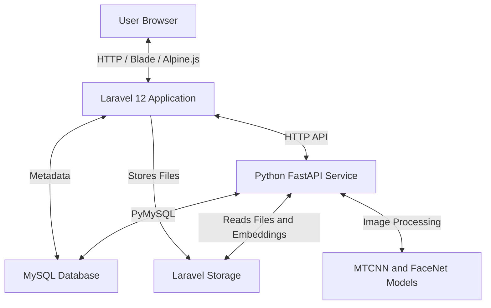

# VisiFoto

VisiFoto is a web-based photo and file management application built with Laravel 12 and a Python FastAPI face-recognition service. The system supports private and public file storage, public gallery access, face-based photo search, and automatic face clustering for public photo collections.

## Main Features

- Drive-style file and folder management.
- Public and private visibility controls for files and folders.
- Public directory gallery for shared folders and photos.
- Face search by uploading a reference photo.
- Configurable similarity threshold and search result limit.
- Folder-scoped face search for faster lookup.
- Automatic face indexing and clustering for public photo folders.
- Cluster management interface for reviewing and renaming grouped faces.

## Architecture

The application consists of a Laravel web application, a MySQL database, local storage, and a Python FaceNet microservice.



## Requirements

### Laravel Application

- PHP `^8.2`
- MySQL or MariaDB
- Composer
- Node.js and npm

### Python FaceNet Service

- Python `>= 3.12`
- Virtual environment support through `venv` or `virtualenv`
- FastAPI and Uvicorn
- MTCNN and FaceNet
- scikit-learn
- PyMySQL
- OpenCV and Pillow
- PyTorch and Torchvision

## Installation

### 1. Configure Laravel

Clone the repository, enter the project directory, and copy the environment file.

```bash
cp .env.example .env
```

Update the database configuration in `.env`.

```env
DB_CONNECTION=mysql
DB_HOST=127.0.0.1
DB_PORT=3306
DB_DATABASE=app_pemotretan
DB_USERNAME=root
DB_PASSWORD=your_password
```

Install dependencies, generate the application key, run migrations, and build the frontend assets.

```bash
composer run setup
```

Create the public storage link.

```bash
php artisan storage:link
```

### 2. Configure the Python Service

Move into the Python service directory and copy its environment file.

```bash
cd python-facenet
cp .env.example .env
```

Update `python-facenet/.env` so the database configuration matches the Laravel `.env` file.

```env
LARAVEL_STORAGE_PATH=../storage/app/public
DB_HOST=127.0.0.1
DB_PORT=3306
DB_DATABASE=app_pemotretan
DB_USERNAME=root
DB_PASSWORD=your_password
```

Create the virtual environment and install the Python dependencies.

```bash
python start.py --install
```

The first installation can take several minutes because it downloads PyTorch and pretrained model weights.

## Running the Application

Start the Laravel application, queue worker, log watcher, and Vite development server.

```bash
composer run dev
```

The Laravel application runs at:

```text
http://localhost:8000
```

Start the Python FaceNet service from the `python-facenet` directory.

```bash
cd python-facenet
python start.py
```

Useful development commands:

```bash
python start.py --reload
python start.py --port 8002
```

By default, the Python service runs at:

```text
http://127.0.0.1:8001
```

The FastAPI documentation is available at:

```text
http://127.0.0.1:8001/docs
```

## Face Indexing

Photos must be indexed before face search and clustering can return results. During indexing, faces are detected and 512-dimensional embeddings are stored for later comparison.

### Index from the Python Service

```bash
cd python-facenet
python index_storage.py
```

Additional indexing options:

```bash
python index_storage.py --path drive-files
python index_storage.py --async-mode
```

### Index from the Laravel Interface

Use the index action from the face search dashboard to start background indexing from the web application.

### Index Through the API

```bash
curl -X POST http://127.0.0.1:8001/index-files
curl -X POST http://127.0.0.1:8001/index-files/async
```

## Configuration

### Laravel `.env`

| Variable | Description | Default |
| --- | --- | --- |
| `FACENET_SERVICE_URL` | Python service base URL. | `http://127.0.0.1:8001` |
| `FACENET_TIMEOUT` | Request timeout in seconds. | `60` |

### Python `.env`

| Variable | Description | Default |
| --- | --- | --- |
| `SIMILARITY_THRESHOLD` | Cosine similarity threshold from `0.0` to `1.0`. Lower values are more lenient. | `0.40` |
| `DBSCAN_EPS` | DBSCAN neighborhood radius. Smaller values create stricter clusters. | `0.4` |
| `DBSCAN_MIN_SAMPLES` | Minimum number of photos required to form a cluster. | `2` |

## API Reference

### Laravel Face Search Routes

| Method | Route | Description |
| --- | --- | --- |
| `GET` | `/face-search` | Show the face search dashboard. |
| `POST` | `/face-search/search` | Search photos using an uploaded reference face. |
| `GET` | `/face-search/status` | Check the Python service status. |
| `POST` | `/face-search/index` | Start face indexing. |
| `DELETE` | `/face-search/index` | Clear existing face embeddings for re-indexing. |

### Python FaceNet Routes

| Method | Route | Description |
| --- | --- | --- |
| `GET` | `/status` | Return service health and database statistics. |
| `POST` | `/index-files` | Index all images synchronously. |
| `POST` | `/index-files/async` | Index all images asynchronously. |
| `POST` | `/index-single` | Index a single uploaded file by ID. |
| `POST` | `/search` | Generate an embedding and run similarity search. |
| `POST` | `/cluster` | Run DBSCAN clustering on public folders. |
| `DELETE` | `/index` | Clear indexed embedding data. |

## Notes

- Ensure the Laravel storage path configured in the Python service points to the same public storage used by Laravel.
- Run face indexing after adding existing photos to storage.
- Use the same database credentials in both `.env` files.
